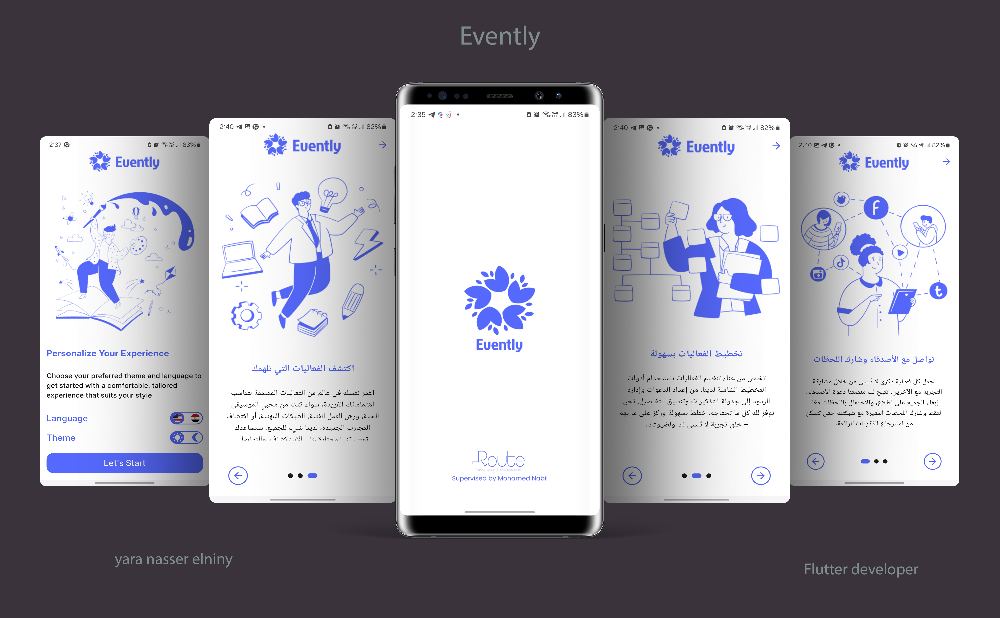
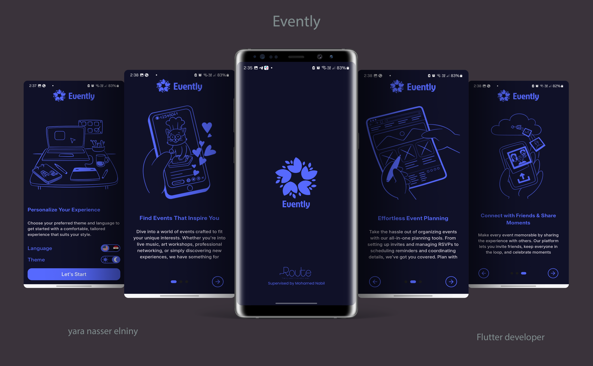
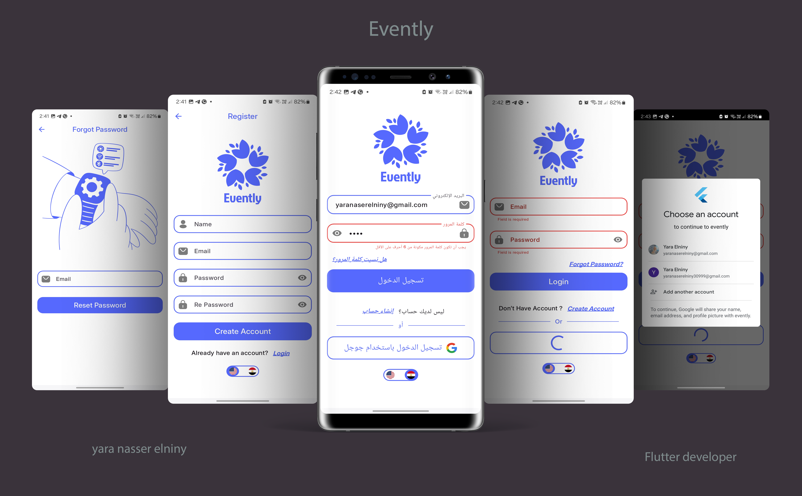
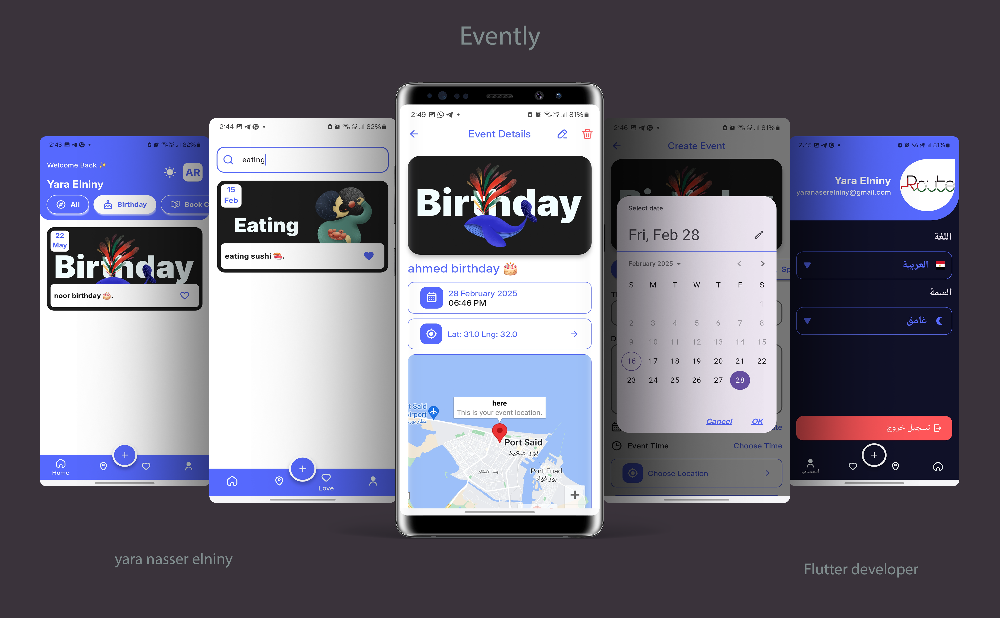

# Evently

## Getting Started

This project is a starting point for Evently application.

A powerful app built with Flutter for creating events associated with a specific place and time so you can easily find your events in one place.

This application is developed for educational purposes. using clean architecture with **MVVM pattern**, **Provider** for state management, and **firebase** for online/offline backend services.

## 📸 Screens

 

 

 

 

 

 

## ✨ Features:

- **Firebase Auth:** login | register via user name and password, forgot password, google sign in.
- **FireStore database:** store and retrieving users data using express queries.
- **Client-Side Validation** on login, register, forgot password pages.
- Real-time Updates via **Firestore Database.**
- data caching for offline use via **Firebase, Hive, Shared Prefrences**.
- Animations ( Lottie, Fading animatin on category section).
- Custom Light/Dark Mode.
- Modern UI with New Material Widgets (Followed the same Route figma design).
- Support both **Arabic and English** locales.(with ability to extend)
- **Search** functionality, applying debounce mechanism.
- Integration with Google Map API service..
- Like | Unlike events.
- Create | Edit | Delete events.
- One time view for onboarding screen.
- Keeps the user session logged in. No need to log in every time the app is opened.

## 📐 How to set-up this project on local machine?

- Fork this project

- Then clone the forked project by

  `git clone github.com/<username>/cat_gallery`

- once cloned, open this project in your favorite code-editor and run: `flutter pub get`
- Wohoo!! now you can now run this project on your emulator or physical device just do `flutter run`

## 📦 App Apk:

[Click here to download the global apk.](https://drive.google.com/file/d/1LcPcbKp7D9_BDQjyb0mt9bCkFQqY0aoh/view?usp=sharing)

## 🎥 App demo:

[Click here to watch Evently demo.](https://drive.google.com/file/d/1NeuNrT6vxMPf0fNVrT5Fx7XNE-d6k5Od/view?usp=sharing)

## 💬 Feedback and Suggestions:

For any feedback or suggestions, feel free to contact me via email:  
📧 [yaranaserelniny30999@gmail.com](mailto:yaranaserelniny30999@gmail.com)

## Enjoy! 💕

If you like this project, don't forget to give it a star ⭐ and fork this project.
